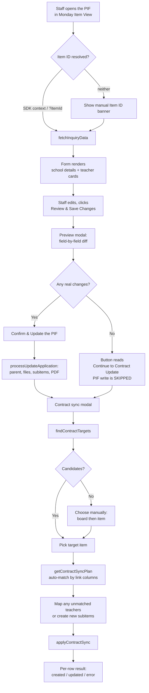
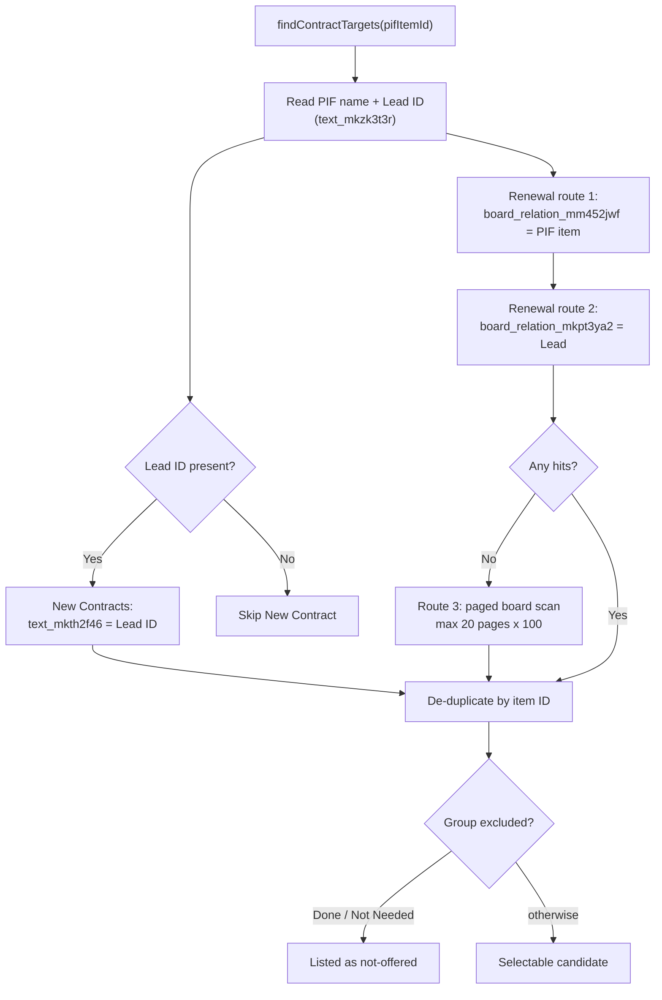
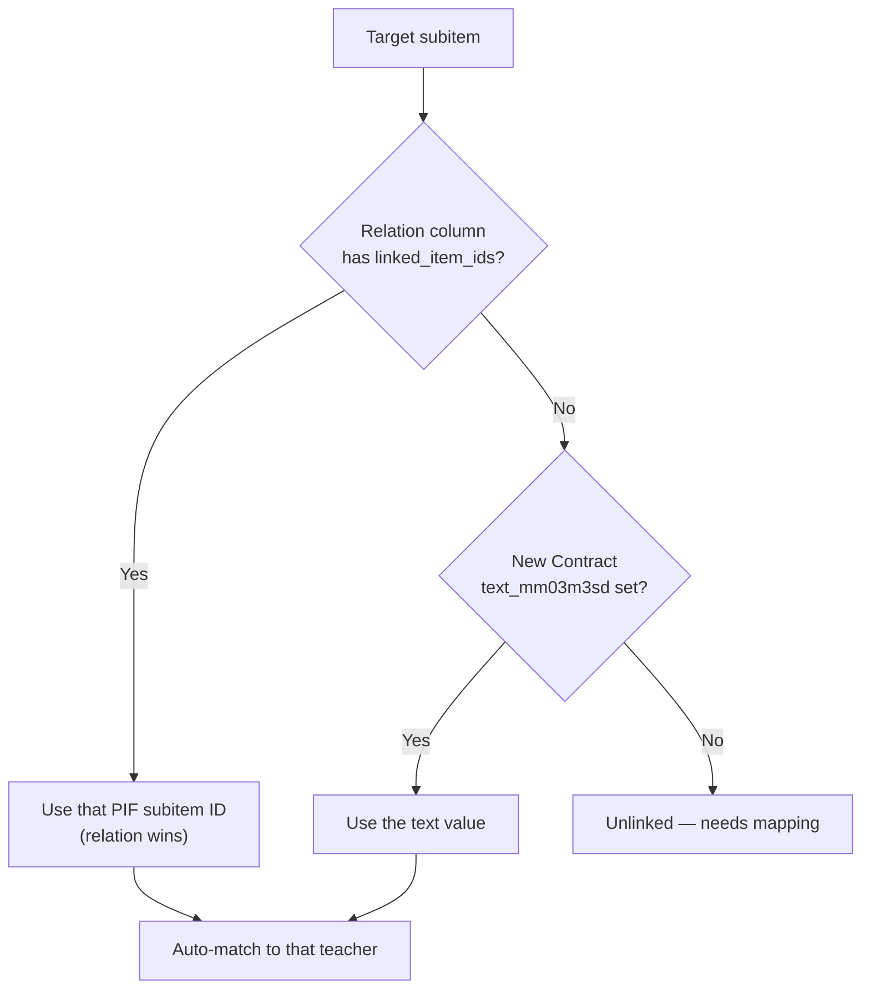

# Kreyco Partnership Inquiry Form — Monday.com Item View & Edit Portal

Google Apps Script web app embedded as a **Monday.com Item View** on the
Quote/Estimate Form (PIF) board. It loads an existing inquiry, lets staff edit
the school details and teacher subitems, and then optionally pushes those
teacher positions onto the linked **New Contract** or **Renewal** item.

> Companion doc: [`PROJECT_OVERVIEW.md`](PROJECT_OVERVIEW.md) covers the original
> edit-portal scope. This README supersedes it for anything involving the
> contract sync.

---

## 1. Quick reference

| | |
| :-- | :-- |
| Apps Script ID | `131ndeYQTpXd_Yg0qn5R2fbbgtzt-UMHpDee4lYhM6sI7iJAU9sXKjvB2` |
| Runtime | V8, timezone `America/New_York` |
| Web app access | `DOMAIN`, executes as deploying user |
| Frame options | `ALLOWALL` (required for the Monday iframe) |

### Deployments

| Deployment | ID | Serves |
| :-- | :-- | :-- |
| `@HEAD` | `AKfycbznz3yNjYErn06xEaTD4fIErPdU4c9uMNvu84cKT3Vt` | Latest pushed code, immediately |
| `@4` | `AKfycbxREIK1Y6XX0PTQptCKggl0naMYK3RkuxRaQiaSXvww85h8WOXYsDjAhdtdSWSnQ1OrAw` | Frozen at version 4 |

**`clasp push` only updates script content.** The `@HEAD` deployment picks it up
straight away; `@4` does not and will keep serving old code until a new version
is created and promoted. Confirm which URL the Monday app points at before
assuming a change is live.

### Script Properties

Set under **Project Settings → Script Properties**:

| Key | Purpose |
| :-- | :-- |
| `MONDAY_API_KEY` | Monday API token. Needs write access to all four boards in §3. |
| `MONDAY_BOARD_ID` | The PIF board, `6938836032` |
| `DRIVE_FOLDER_ID` | Root Drive folder for uploads and generated PDFs |
| `LOG_SHEET_ID` | **Optional.** Spreadsheet for the activity log (§10). Unset means logging is off. |
| `NEW_CONTRACT_BOARD_ID` | **Optional.** Overrides the New Contract board in source. |
| `NEW_CONTRACT_SUBITEM_BOARD_ID` | **Optional.** Overrides the New Contract subitem board. |
| `RENEWAL_BOARD_ID` | **Optional.** Overrides the Renewal board in source. |
| `RENEWAL_SUBITEM_BOARD_ID` | **Optional.** Overrides the Renewal subitem board. |

The four optional board keys let the sync be pointed at test boards without an
edit-and-push. Unset, the IDs in `CONTRACT_TARGET_DEFAULTS` apply. Column IDs
are deliberately not configurable: they are structural, so a change there is a
code change rather than a configuration one.

### Sync with Apps Script

```bash
clasp pull    # fetch deployed source (overwrites local — pull into a scratch dir to compare)
clasp push    # upload local source
clasp push -f # same, but overwrites the remote manifest
```

`clasp push` can print **"Skipping push."** and exit without doing anything.
That means clasp thinks the manifest changed and is waiting for a confirmation
it cannot get non-interactively — usually just a trailing-newline difference on
`appsscript.json`. Diff the manifest first, then use `-f` once you have
confirmed there is no semantic change.

To check what is actually deployed without destroying local work:

```bash
mkdir /tmp/remote && cp .clasp.json /tmp/remote/ && cd /tmp/remote && clasp pull
```

Note that `clasp pull` writes the server-side script file as `code.js` while the
local project uses `code.gs`. Both map to the same Apps Script `SERVER_JS` file;
there is no duplicate on the server.

---

## 2. File layout

```
Partner Inquiry Form - Item View/
├── appsscript.json      # Manifest: scopes, timezone, XFrameOptions ALLOWALL
├── .clasp.json          # Script ID + rootDir
├── code.gs              # All backend logic (see §6)
├── Index.html           # Page shell, both modals
├── JavaScript.html      # All client logic + a local mock of google.script.run
├── Stylesheet.html      # Tailwind CDN config, dark mode, option-panel styles
├── PROJECT_OVERVIEW.md  # Original edit-portal documentation
└── README.md            # This file
```

`Index.html` pulls the other two in via `<?!= include('Stylesheet') ?>` /
`<?!= include('JavaScript') ?>`, and `doGet` injects `?itemId` into
`window.SERVER_ITEM_ID`.

---

## 3. Boards

| Board | Parent ID | Subitems ID |
| :-- | :-- | :-- |
| Quote/Estimate Form (PIF) | `6938836032` | — |
| \*New Contracts | `9746564033` | `9746564389` |
| Renewal | `18417033017` | `18417033021` |

Board IDs are taken from `Send to OPS/Zap2_Step4_Resolver.js`, which resolves the
same relationships for the OPS workflow. Keep the two in step if boards move.

### PIF columns

| Level | Column ID | Meaning |
| :-- | :-- | :-- |
| Parent | `name` | School name (item title) |
| Parent | `text6__1` | Address |
| Parent | `text__1` | Contact full name |
| Parent | `text5__1` | Email |
| Parent | `text_mkzc61ta` | Phone |
| Parent | `long_text7__1` | Additional information |
| Parent | `text06__1` | Number of teachers / TBD text |
| Parent | `color_mksnhewa` | Global certification (status) |
| Parent | `long_text_mkzw9xs4` | School calendar |
| Parent | `long_text_mkzwd7xp` | Bell schedule |
| Parent | `wf_edit_link_wdsn` | Generated submission PDF link |
| Parent | `text_mkzk3t3r` | **Lead ID** — drives New Contract discovery |
| Subitem | `name` | Position / teacher title |
| Subitem | `long_text_mkzb794g` | Description |
| Subitem | `text_mkzcyvvk` | Teaching schedule |
| Subitem | `long_text_mkzc84xz` | Duties |
| Subitem | `long_text_mkzhdnv7` | Annual salary |
| Subitem | `long_text_mkzhk5pv` | Prorated salary |
| Subitem | `text_mkzc34ak` | Start date |
| Subitem | `text_mkzce7mc` | End date / last day |
| Subitem | `text_mkzdenv2` | Instructional days (computed) |
| Subitem | `long_text_mm02phkt` | Campus name |
| Subitem | `long_text_mm026ebf` | Campus address |
| Subitem | `dropdown_mkzc6dgm` | Grade levels |
| Subitem | `dropdown_mkzcq8h6` | Language acquisition |
| Subitem | `dropdown_mkzcbcq4` | Languages |
| Subitem | `dropdown_mm02xrpn` | Humanities |
| Subitem | `dropdown_mm02azn5` | STEM |
| Subitem | `dropdown_mm02m53x` | SPED |
| Subitem | `dropdown_mm02v870` | Paraprofessional |
| Subitem | `dropdown_mm08qwm1` | CTE |
| Subitem | `color_mkzcn0h2` | Modality (status) |

### Link columns used by the contract sync

| Purpose | New Contract | Renewal |
| :-- | :-- | :-- |
| Find the item | `text_mkth2f46` (parent, text) matched to the PIF's Lead ID | `board_relation_mm452jwf` (parent) → PIF parent, **or** `board_relation_mkpt3ya2` (parent) → Lead |
| PIF subitem reference | `text_mm03m3sd` (subitem, text) **and** `board_relation_mm3y1h5m` (subitem, relation) | `board_relation_mm456sv` (subitem, relation) |

New Contract carries **both** a legacy text column and a relation column for the
same fact. The portal reads the relation first and falls back to the text
column, and writes both on every sync — so the relation backfills ahead of the
planned migration away from `text_mm03m3sd`.

---

## 4. The two boards behave differently

This is the single most important thing to understand before changing anything.

**New Contract** subitems have *real* dropdown and status columns, so values must
be copied across explicitly:

| PIF subitem field | → New Contract subitem | Type |
| :-- | :-- | :-- |
| `modality` | `color_mkzmfhff` | status |
| `gradeLevels` | `dropdown_mkztz3vk` | dropdown |
| `languageAcquisition` | `dropdown_mkztba57` | dropdown |
| `languages` | `dropdown_mkzt9c5y` | dropdown |
| `humanities` | `dropdown_mm039knb` | dropdown |
| `stem` | `dropdown_mm034g` | dropdown |
| `sped` | `dropdown_mm032ybs` | dropdown |
| `paraprofessional` | `dropdown_mm03fsx6` | dropdown |
| `description` | `long_text_mkzzxb21` | **create only** — Talent edits this contract-side, so it is never refreshed |

**Renewal** subitems expose the same concepts as *mirror* (`lookup_*`) columns
that read **through** `board_relation_mm456sv`. Mirrors are read-only, so there
is nothing to copy — setting the relation makes the fields populate themselves.

Consequences:

- `buildContractFieldValues()` returns `{}` for Renewal by design.
- A new Renewal subitem needs only a name and the relation.
- **CTE has no New Contract column** and is not synced. `dropdown_mkztn0a0`
  exists on the NC subitem board but has never been mapped; the pre-existing Zap
  writes `[]` to it. Do not assume it is the CTE column without checking.
- `text_mm5a6trh` was named as a refresh target during design but appears in no
  board export, Zap, or resolver. It is deliberately **not** written.

---

## 5. End-to-end flow



### Why the PIF saves *before* the contract step

Newly added teacher cards have no Monday subitem ID until the PIF write happens.
The contract sync matches on subitem IDs, so ordering it after the save is what
makes new positions mappable at all.

### Why a no-op save is skipped

`processUpdateApplication` rewrites every column **and** regenerates the summary
PDF on every run, creating a new Drive file and updating `wf_edit_link_wdsn`.
Confirming an unchanged inquiry would produce a duplicate PDF for nothing, so
`generateChangesSummary()` returns a `changeCount` and the preview modal skips
the write entirely when it is zero.

`changeCount` counts: parent field edits, newly attached files, new teacher
cards, modified existing teachers, deleted teachers, and TBD description edits.

---

## 6. Backend reference (`code.gs`)

### Sections

1. Web app init and utilities — `doGet`, `include`, `getConfig`, `callMondayAPI`
2. Dropdown options and data fetching
3. Submission updating and mutations
4. Google Drive helpers
5. PDF generation
6. **New Contract / Renewal subitem sync**

### `callMondayAPI(query, apiVersion)`

`apiVersion` is optional and **only** passed by the contract-sync calls, which
pin `2024-10`. They read Connect Boards columns via the `BoardRelationValue`
fragment, which needs a version that supports it. Everything else keeps
Monday's default so existing behaviour is untouched.

> Connect Boards columns return `null` for `text` and `value` even when the UI
> visibly shows a linked item. Always read `linked_item_ids`.
> See the [Monday Connect boards reference](https://developer.monday.com/api-reference/reference/connect).

### Client-callable functions

| Function | Purpose |
| :-- | :-- |
| `getBoardDropdownOptions()` | Column labels for the option panels |
| `fetchInquiryData(itemId)` | Parent + subitems for one PIF item |
| `processUpdateApplication(data)` | Writes the PIF: parent, files, subitems, PDF |
| `findContractTargets(pifItemId)` | Step 1 — candidate contract/renewal items |
| `listManualTargets(targetKey)` | Step 1b — browse one board's Won/Pending items |
| `getContractSyncPlan(pifItemId, targetKey, targetItemId)` | Step 2 — auto-match teachers to subitems |
| `applyContractSync(payload)` | Step 3 — create/update target subitems |

### Target discovery



Renewal items are **not** reliably linked straight back to the PIF — the first
production test found the item only via the Lead hop. Keep all three routes.

Each route records a line in `diagnostics`, surfaced in the UI under
*"How were these results found?"*. That is the fastest way to tell an API
rejection apart from a genuine no-match without opening Apps Script logs.

### Group filters

```js
EXCLUDED_GROUP_PATTERN = /\bdone\b|\bnot\s*needed\b/i   // never a target
MANUAL_GROUP_PATTERN   = /won|pending/i                 // offered in manual pick
```

The word boundaries matter: an unbounded `/done/` also matches a group named
**Abandoned**. Excluded groups are filtered from both automatic and manual
paths.

### Subitem matching



Anything unmatched defaults to **create a new subitem**, and the user can
override any row. The plan is rejected server-side if two teachers are mapped to
the same target subitem; the UI blocks it before submit as well.

### Write behaviour

- Matched row → `change_multiple_column_values` on the target subitem.
- Unmatched row → `create_subitem` under the target parent.
- **Nothing is ever deleted.** Target subitems with no PIF counterpart are left
  untouched.
- Both use `create_labels_if_missing: true`, so a PIF label absent from the
  target board is created rather than failing the write.
- Per-row failures are captured and reported individually; one bad row does not
  abort the rest.

### Subitem naming

Created subitems reuse the convention from the existing *Notify Talent* Zap so
portal-created and Zap-created rows look identical on the board:

```
[Grade] - [Language Acq] - [Languages] - [Parent Name in Proper Case]
```

Each segment capped at 50 characters, whole name at 200 with an ellipsis.
**Commas become `•`** — Monday treats a comma in an item name as a separator and
would otherwise create several subitems from one call.

---

## 7. Front end notes (`JavaScript.html`)

### Item ID resolution order

1. `window.SERVER_ITEM_ID` injected by `doGet` from `?itemId`
2. `monday.get("context")` and `monday.listen("context", …)` via the SDK
3. `?itemId` read from `window.location.search`
4. Manual entry banner

### Option panels

The eight multi-select groups are driven by a single `OPTION_GROUPS` array
mapping payload field → label → Monday column. Adding a group means adding one
row there plus one `renderOptionPanel(...)` call in the card markup.

Ordering and filtering mirror the original Partner Inquiry Form:

- Grade levels: band labels removed, then sorted `K, PreK, 1st…12th`
- Languages: `Other` removed
- Modality: `Both options are fine.` removed (school-level answer only)
- Everything else: `NA` / `Other` pinned to the bottom

Values already saved on a subitem stay checked even if the label has since been
removed from the board, so an edit never silently drops previously submitted
data.

### Load-order race

`monday.get("context")` can resolve before `getBoardDropdownOptions()` returns.
If a submission renders before the labels are in hand, every option panel comes
up empty. `renderInquiry()` is therefore gated on `dropdownOptionsLoaded`, with
the payload parked in `pendingInquiryResponse` until options arrive.

### Local development

`JavaScript.html` installs a mock `google.script.run` whenever `google` is
undefined, covering all seven server functions with representative data —
including unsorted grade labels and band labels so the sort/filter rules are
exercisable. To run the app outside Apps Script, inline the includes:

```python
html = Path("Index.html").read_text()
html = html.replace("<?!= include('Stylesheet'); ?>", Path("Stylesheet.html").read_text())
html = html.replace("<?!= include('JavaScript'); ?>", Path("JavaScript.html").read_text())
html = html.replace('window.SERVER_ITEM_ID = "<?= itemId ?>";', 'window.SERVER_ITEM_ID = "6938836032";')
```

Serve over `http://` rather than `file://` so the CDN assets load.

Syntax-check before pushing — Apps Script will happily accept a broken file:

```bash
cp code.gs /tmp/code.js && node --check /tmp/code.js
sed '1d;$d' JavaScript.html > /tmp/check.js && node --check /tmp/check.js
```

---

## 8. Known constraints

**The *Notify Talent* Zap still runs.** It fires when a PIF is linked to a Lead
and creates New Contract subitems independently. The portal is idempotent — it
skips any target subitem already linked to a PIF subitem — so the two do not
duplicate each other's work. But if the Zap ever creates a subitem *without*
writing `text_mm03m3sd`, the portal will read it as unlinked and create a second
one.

**Manual selection bypasses discovery, not matching.** Picking an item by hand
that was never linked to this PIF means every teacher shows as NEEDS MAPPING and
defaults to creating new subitems. Check the dropdowns before committing a first
manual sync.

**Manual lists load 200 items per group** with a client-side search filter. A
group larger than that is flagged in the UI. If this becomes limiting, move to a
server-side name query.

**The Renewal board scan is capped** at 20 pages of 100 items. It only runs when
both filtered lookups return nothing.

**Teacher schedule text.** `processUpdateApplication` appends `File: <url>` to
`text_mkzcyvvk` after a schedule upload. `stripFileReferences()` removes any
prior `File:` line first, because the old value round-trips through the edit
form and would otherwise accumulate one line per upload.

**Historical data loss.** Before the Language Acquisition panel was added, the
form never submitted `languageAcquisition`, and the backend treats a missing
multi-select as "clear it" — so every save wiped `dropdown_mkzcq8h6` on every
teacher subitem. Fixed going forward; subitems edited through the portal before
that fix have already lost the value and can only be recovered from Monday's
item activity log.

---

## 9. Troubleshooting

| Symptom | Cause |
| :-- | :-- |
| Nothing appears in the activity log | `LOG_SHEET_ID` is unset (logging off by design), or the deployer has not re-authorized since the `spreadsheets` scope was added. See §10. |
| Option panels stuck on spinners | `getBoardDropdownOptions()` failed, or the subtasks column could not be resolved. Check the Apps Script log. |
| "No linked item found" | Expand *How were these results found?* — it names each lookup and its result. |
| A lookup "was rejected by the API" | Monday refused server-side filtering on that column. The scan fallback is doing the work; check the item is within the page cap. |
| Every teacher shows NEEDS MAPPING | The target's link columns are empty — normal for a first sync or a manual pick. |
| Row error mentioning labels | `create_labels_if_missing` did not cover it; likely a status column with a value the board rejects. |
| Changes not visible in Monday | The app may be pointed at the `@4` deployment. See §1. |
| `clasp push` prints "Skipping push." | Manifest guard. Diff `appsscript.json`, then use `-f`. |

---

## 10. Activity logging

Every meaningful action can be appended as one row to a Google Sheet.

### Turning it on

Logging is **off** unless the `LOG_SHEET_ID` script property is set. With it
unset, every log call returns immediately and the portal behaves exactly as it
did before.

To switch it on, open the Apps Script editor and run `setupLogSheet()` once:

- With `LOG_SHEET_ID` already set, it verifies the sheet is reachable and logs
  its URL and row count.
- With nothing set, it creates a new spreadsheet, stores the ID in
  `LOG_SHEET_ID`, and logs the URL.

You can also create the spreadsheet yourself and paste its ID into
`LOG_SHEET_ID` — the `Activity Log` tab and header row are created on first
write.

### Re-authorization is required

Adding the logger meant adding `https://www.googleapis.com/auth/spreadsheets`
to `oauthScopes`. Because this manifest declares scopes **explicitly**, Apps
Script does not detect them automatically, and a missing scope fails at
runtime rather than at push time.

After pushing this change the deploying user must re-authorize, or every call
that touches the sheet will fail. Open the Apps Script editor, run any
function, and accept the consent prompt. The web app runs as
`USER_DEPLOYING`, so it is that account's authorization that matters — not the
person using the portal.

### What is recorded

| Column | Contents |
| :-- | :-- |
| Timestamp | `yyyy-MM-dd HH:mm:ss` in the script timezone |
| Event | `LOAD`, `SAVE`, or `CONTRACT_SYNC` |
| Status | `success`, `partial`, or `error` |
| PIF Item ID | The inquiry item |
| PIF Name | School name at the time of the action |
| Monday User | Monday user ID plus the Google account, e.g. `12345 (staff@kreyco.com)` |
| Summary | One human-readable line |
| Details | JSON, truncated at 20,000 characters |
| Duration (ms) | Server-side time for the call |

### What a `SAVE` records

`Details` is a JSON object carrying a field-level diff of the save. Only
sections with content appear, so an ordinary save stays small — a typical one
is around 200 characters:

```json
{
  "item": { "text6__1": ["1 Main St", "2 Oak Ave"] },
  "subitems": { "9910": { "name": ["Math 9", "Math 9/10"] } },
  "created": [{ "id": "9931", "name": "ESL Support" }],
  "deleted": [{ "id": "9908", "name": "Retired position" }],
  "warnings": ["The school calendar file could not be attached. ..."],
  "errors": [{ "step": "calendar_upload", "file": "cal.pdf", "error": "..." }]
}
```

Every change is `[before, after]`. The "before" side comes from the snapshot
`loadItemScope_` takes when it validates the item, so the diff costs no extra
API call. Individual values are trimmed at 180 characters, which keeps one
long free-text field from crowding out the errors.

`errors` records the technical detail for each failed step — `calendar_upload`,
`bell_schedule_upload`, `teacher_schedule_upload`, `delete_subitem`,
`pdf_regeneration`, or `save` for a throw that ended the whole call. `Status`
reads `partial` when the save completed with errors recorded.

A save that throws part way through still logs everything applied before the
throw, which is what makes a half-applied save recoverable by hand.

Two known imprecisions, both deliberate: dropdown values are compared as
comma-joined labels, so reordering the same labels reads as a change; and a
value equal after trimming whitespace is treated as unchanged.

`CONTRACT_SYNC` details include the target board and item plus a per-row
breakdown of what was created, updated, or failed — which is the audit trail
for writes to the contract boards. It records per-row status and errors, but
not a field-level diff.

### Where the user comes from

The Monday.com SDK context is the primary attribution — that is the account
the person is actually working in — so the client captures `context.user.id`
and passes it as `clientMeta` on each call.

Since the web app moved to `DOMAIN` access, `Session.getActiveUser()` also
resolves for internal users, and it is recorded alongside the Monday ID. That
covers the case where the SDK context has not resolved, such as the portal
being opened directly by URL rather than embedded in Monday.com.

### Design guarantees

- **Logging never breaks the portal.** Every logging path swallows its own
  errors into the Apps Script log.
- **Internal calls are not logged twice.** `fetchInquiryData` only writes a
  `LOAD` row when `clientMeta` is present, and the contract-sync functions call
  it without that argument.
- **Helper functions end in `_`** so they cannot be reached by
  `google.script.run`. `setupLogSheet()` is deliberately public so it can be
  run from the editor.

### Known limitation

Rows are appended with `appendRow`, which is not guarded by `LockService`. Two
people saving in the same instant could in principle interleave. Given the
expected volume this is not worth the added latency, but it is the thing to
change first if logging is ever extended to high-frequency events.
